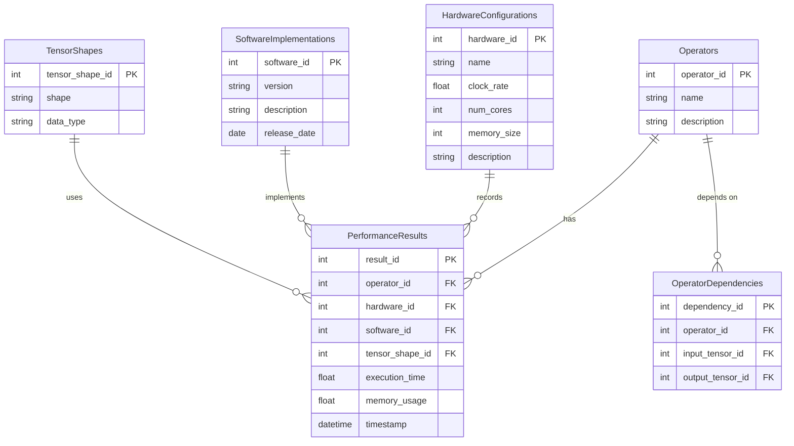

### README: Database Design for AI Operator Performance Results

#### Question:   
We aim to store the performance results of operators (e.g., Layer Norm and GEMM) and series of operators represented as dependency graphs of input and output tensors. Please design a good database. For example, note that a well-designed database should take into account the following factors.
- The hardware configuration of future AI platforms can change (e.g., clock rate adjustments).
- Software implementations may be updated (e.g., improved Layer Norm kernel development).
- Results should be easily comparable across different hardware types.
- Operator performance can vary depending on tensor shapes and data types.

  
### README: AI Operator Performance Database

#### Purpose
This database is built to store and manage performance results of AI operators (like Layer Norm and GEMM) and their sequences. It handles changes in hardware and software, making it easy to compare results across different setups.

#### Key Features
1. **Flexibility**: Adapts to new hardware and software updates.
2. **Comparability**: Allows easy comparison of results across different hardware.
3. **Detailed Records**: Tracks performance based on tensor shapes and data types.

#### Database Structure

The database includes these main tables:

1. **Operators**: Details of each operator.
2. **PerformanceResults**: Performance metrics for each operator.
3. **HardwareConfigurations**: Different hardware setups.
4. **SoftwareImplementations**: Various software versions.
5. **TensorShapes**: Shapes and data types of tensors.
6. **OperatorDependencies**: Dependency graph of operators.

#### Table Details

- **Operators**: 
  - `operator_id` (Primary Key)
  - `name`
  - `description`

- **PerformanceResults**: 
  - `result_id` (Primary Key)
  - `operator_id` (Foreign Key)
  - `hardware_id` (Foreign Key)
  - `software_id` (Foreign Key)
  - `tensor_shape_id` (Foreign Key)
  - `execution_time`
  - `memory_usage`
  - `timestamp`

- **HardwareConfigurations**: 
  - `hardware_id` (Primary Key)
  - `name`
  - `clock_rate`
  - `num_cores`
  - `memory_size`
  - `description`

- **SoftwareImplementations**: 
  - `software_id` (Primary Key)
  - `version`
  - `description`
  - `release_date`

- **TensorShapes**: 
  - `tensor_shape_id` (Primary Key)
  - `shape`
  - `data_type`

- **OperatorDependencies**: 
  - `dependency_id` (Primary Key)
  - `operator_id` (Foreign Key)
  - `input_tensor_id` (Foreign Key)
  - `output_tensor_id` (Foreign Key)

#### Database Diagram

### How to Use

1. **Add New Operators**: Insert operator details into `Operators`.
2. **Record Performance Results**: Insert data into `PerformanceResults`, linking to the relevant operator, hardware, software, and tensor shape.
3. **Update Hardware**: Modify `HardwareConfigurations` for new hardware.
4. **Update Software**: Add new versions to `SoftwareImplementations`.
5. **Define Tensor Shapes**: Add new shapes and types to `TensorShapes`.
6. **Set Operator Dependencies**: Insert dependencies into `OperatorDependencies`.

This setup captures all necessary details and provides an easy-to-use framework for storing and comparing AI operator performance across various hardware and software setups.
