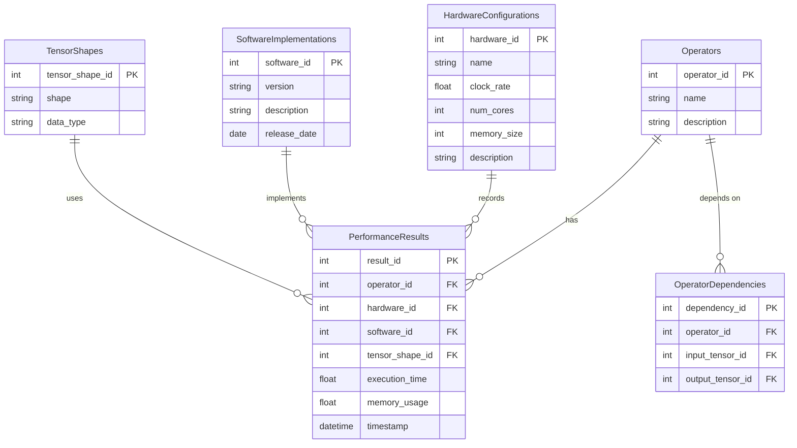

### README: Database Design for AI Operator Performance Results

#### Overview
This database is designed to store and manage the performance results of various AI operators (e.g., Layer Norm, GEMM) and sequences of these operators represented as dependency graphs of input and output tensors. It is structured to accommodate changes in hardware configurations, software implementations, and varying tensor shapes and data types. Additionally, it ensures that results can be easily compared across different hardware types.

#### Key Features
1. **Flexibility**: Supports evolving hardware configurations and software updates.
2. **Comparability**: Facilitates easy comparison of performance results across different hardware types.
3. **Detailed Records**: Captures variations in operator performance based on tensor shapes and data types.

#### Database Schema

The database schema includes the following main tables:

1. **Operators**: Stores details of individual operators.
2. **PerformanceResults**: Records the performance metrics for each operator.
3. **HardwareConfigurations**: Captures the details of different hardware setups.
4. **SoftwareImplementations**: Stores information about various software versions and implementations.
5. **TensorShapes**: Describes the shapes and data types of tensors used in the performance tests.
6. **OperatorDependencies**: Represents the dependency graph of operators using input and output tensors.

#### Tables and Relationships

- **Operators**: 
  - `operator_id` (Primary Key)
  - `name`
  - `description`

- **PerformanceResults**: 
  - `result_id` (Primary Key)
  - `operator_id` (Foreign Key)
  - `hardware_id` (Foreign Key)
  - `software_id` (Foreign Key)
  - `tensor_shape_id` (Foreign Key)
  - `execution_time`
  - `memory_usage`
  - `timestamp`

- **HardwareConfigurations**: 
  - `hardware_id` (Primary Key)
  - `name`
  - `clock_rate`
  - `num_cores`
  - `memory_size`
  - `description`

- **SoftwareImplementations**: 
  - `software_id` (Primary Key)
  - `version`
  - `description`
  - `release_date`

- **TensorShapes**: 
  - `tensor_shape_id` (Primary Key)
  - `shape`
  - `data_type`

- **OperatorDependencies**: 
  - `dependency_id` (Primary Key)
  - `operator_id` (Foreign Key)
  - `input_tensor_id` (Foreign Key)
  - `output_tensor_id` (Foreign Key)

#### Mermaid Diagram

### Usage

1. **Adding New Operators**: Insert operator details into the `Operators` table.
2. **Recording Performance Results**: Insert performance data into the `PerformanceResults` table, linking to the appropriate operator, hardware configuration, software implementation, and tensor shape.
3. **Updating Hardware Configurations**: Modify the `HardwareConfigurations` table as new hardware setups are introduced.
4. **Updating Software Implementations**: Insert new software versions and descriptions into the `SoftwareImplementations` table.
5. **Defining Tensor Shapes**: Add new tensor shapes and data types to the `TensorShapes` table.
6. **Defining Operator Dependencies**: Insert dependency relationships into the `OperatorDependencies` table to represent the flow of tensors between operators.

This design ensures that all necessary details are captured and provides a flexible framework for storing and comparing AI operator performance results across various hardware and software environments.
